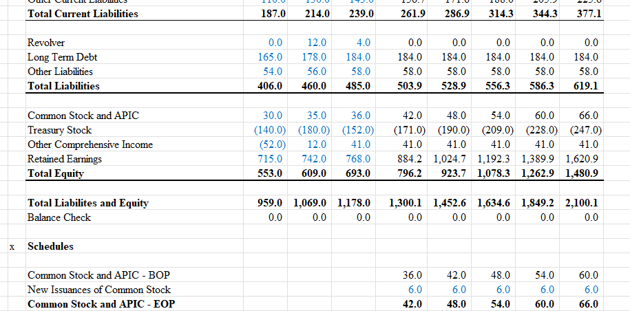

# AfriPure Home Essentials Ltd. - Integrated 3-Statement Financial Model

### Project Overview & Business Case

This repository contains a comprehensive, integrated 3-statement financial model built from scratch in Microsoft Excel. The model forecasts the financial performance of **AfriPure Home Essentials Ltd.**, a fictional, fast-growing Kenyan consumer goods company, from 2025 to 2029.

The primary objective of this project was to translate a compelling business narrative into a dynamic financial forecast. The model serves as a strategic tool to analyze the company's growth trajectory, assess its operational efficiency, and evaluate its capital allocation strategy amidst regional expansion. The intended audience for this analysis would be the executive leadership team and potential investors, providing data-driven support for key decisions regarding investment, shareholder returns, and debt management.

---

### Executive Summary: Key Insights from the Model

The model projects a period of robust, profitable growth for AfriPure, underpinned by strategic investments and improving operational discipline.

*   **Sustained Top-Line Growth:** Revenue is projected to grow from **KSh 1.2B** in 2024 to **KSh 1.89B** by 2029, driven by a consistent **9.5%** annual growth rate fueled by market expansion into Ethiopia and Rwanda.
*   **Margin Recovery and Stability:** After a temporary compression to **34.7%** in 2023 due to raw material costs, Gross Margins are forecasted to recover and stabilize at a healthy **~37.4%**, reflecting improved supplier contracts and investments in production automation.
*   **Powerful Cash Generation:** The company is set to become a strong cash generator, with the cash balance growing from **KSh 347M** in 2025 to over **KSh 748M** by 2029. This is driven by strong Net Income and disciplined working capital management.
*   **Shareholder-Focused Capital Allocation:** The model demonstrates a balanced capital strategy, funding **KSh 120M** in annual dividends and **KSh 19M** in annual share buybacks while maintaining stable debt levels, signaling confidence in long-term value creation.

---

### Tools & Technologies

*   **Primary Tool:** Microsoft Excel

---

### Model Structure & Methodology

This is a fully integrated 3-statement model where the Income Statement, Balance Sheet, and Cash Flow Statement are dynamically linked. All calculations are built from scratch to ensure a deep understanding of the mechanical and logical connections between the statements.

The model is fully integrated and balanced across all forecast periods, as verified by the balance check shown below. This confirms that the fundamental accounting equation (Assets = Liabilities + Equity) holds true for the entire forecast horizon.

**Key Drivers & Assumptions:**
1.  **Income Statement:** Projections are driven by a top-down approach, starting with a revenue growth assumption of 9.5%. Margins for COGS and Operating Expenses are based on historical performance and strategic goals.
2.  **Balance Sheet:** Working capital accounts (Accounts Receivable, Inventory, Accounts Payable) are projected as a percentage of revenue or COGS. PP&E and Intangible Assets are driven by dedicated schedules that account for CAPEX, purchases, depreciation, and amortization.
3.  **Cash Flow Statement:** Built from the Income Statement and changes in the Balance Sheet. It serves as the critical link, with the ending cash balance flowing to the next period's Balance Sheet.
4.  **Debt & Cash Plug (Revolver):** The model includes a revolving credit facility that is automatically drawn upon to meet a minimum cash balance and paid down with excess cash flow, ensuring solvency.

---

### Strategic Recommendations (Based on Model Output)

The model's output surfaces several key strategic discussion points for AfriPure's management:

1.  **Capital Deployment Strategy:** The significant cash buildup by 2029 (KSh 748M) presents an opportunity. Management should evaluate strategies for deploying this capital more efficiently, such as:
    *   Increasing the share buyback program.
    *   Issuing a special dividend to shareholders.
    *   Pursuing a strategic bolt-on acquisition to accelerate market entry in new regions.
2.  **Operational Deep-Dive:** The margin compression in 2023 highlights a vulnerability. A deeper analysis into the specific drivers (e.g., which raw materials, which logistics routes) is recommended to build a more resilient supply chain.
3.  **Debt Optimization:** With strong and predictable cash flows, the company could consider optimizing its capital structure, potentially taking on strategic debt to fund a major expansion project at a lower cost of capital than equity.

---

### Future Improvements & Learning Goals

This project is the first iteration, built with the primary goal of mastering the mechanics of a fully integrated model. Future enhancements will focus on increasing its sophistication and dynamism:

*   **Build a DCF Valuation Model:** The immediate next step is to build a Discounted Cash Flow (DCF) model that leverages the Unlevered Free Cash Flow (UFCF) projections from this 3-statement model to determine the company's intrinsic value.
*   **Incorporate Ratio-Driven Projections:** Enhance the realism of the balance sheet by driving working capital accounts using operational ratios (DSO, DIO, DPO) rather than simple percentages of revenue/COGS.
*   **Add Scenario & Sensitivity Analysis:** Build in switches to model different scenarios (e.g., Base Case, Upside Case, Downside Case) and create sensitivity tables to analyze the impact of key variables on outputs like Net Income and company valuation.

This iterative approach ensures the model evolves from a functional tool into a truly powerful strategic asset.